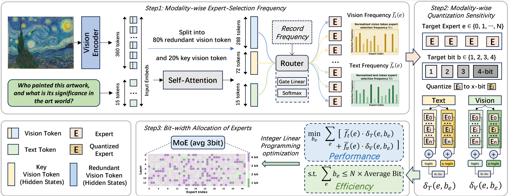
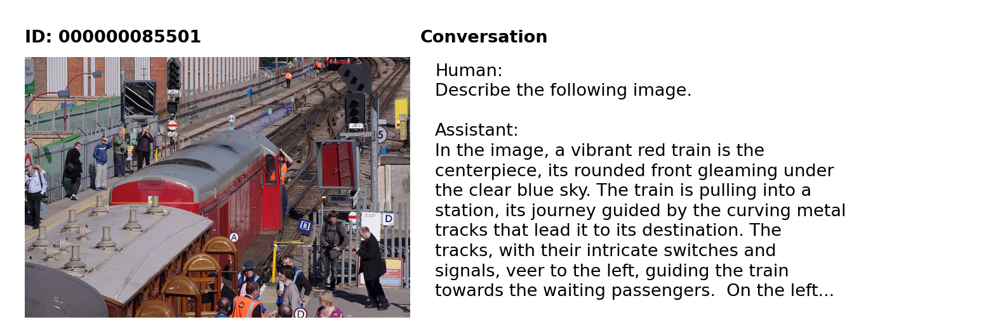
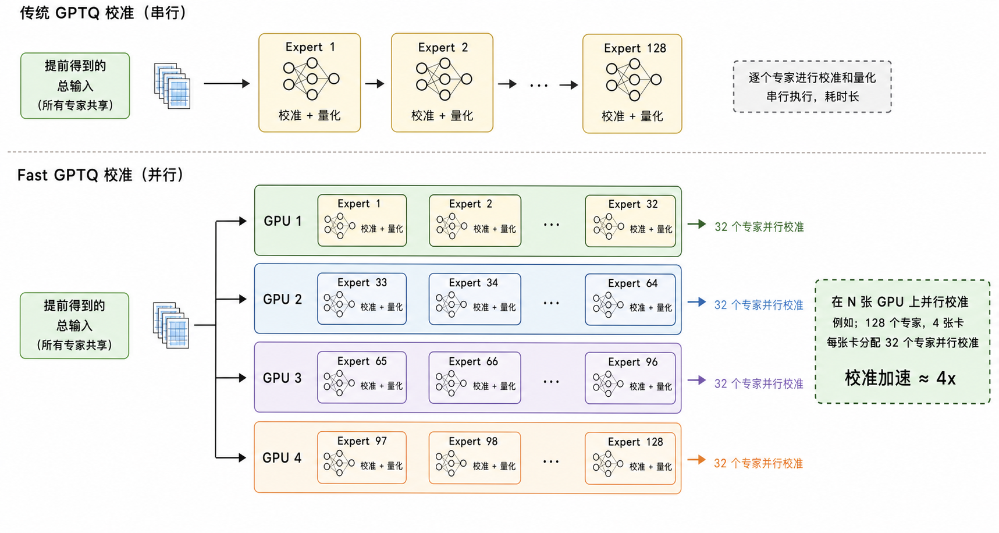
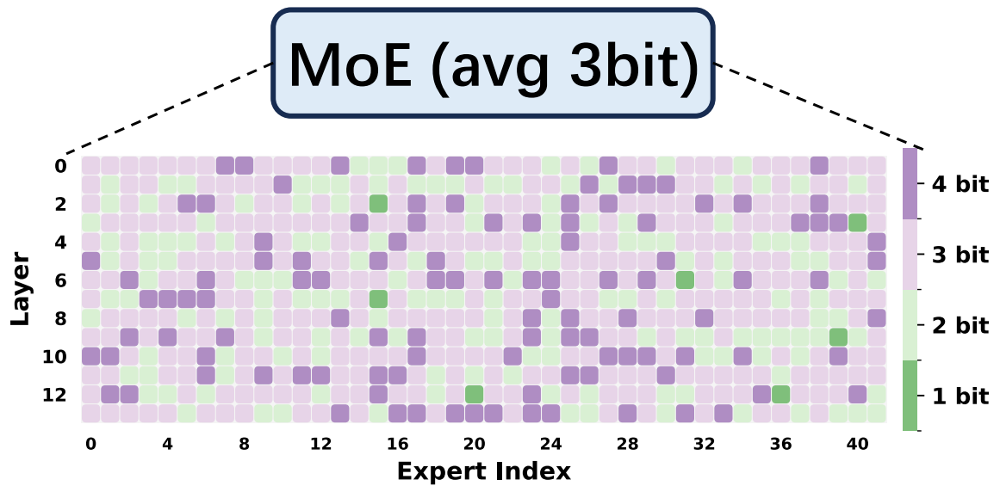

# MODE

This repository contains the official implementation for **MODE: Modality-Decomposed Expert-Level Mixed-Precision Quantization for MoE Multimodal LLMs**.

MODE builds on the `mllm_quant` code path for multimodal MoE-MLLM quantization, including RTN, GPTQ, fast GPTQ, QuaRot-compatible rotation, calibration utilities, expert routing analysis, and expert-level mixed-precision quantization.



## ⚙️ Installation

Use the same CUDA / PyTorch stack as your MLLM environment. A typical local setup is:

```bash
git clone git@github.com:MingZwhy/MODE.git
cd MODE
git submodule update --init --recursive
pip install -e .
pip install -e 3rdparty/lmms-eval
pip install vllm==0.14.1
```

`lmms-eval` is recorded as a submodule under `3rdparty/lmms-eval`. `vllm` is not vendored in `3rdparty`; install the matching runtime wheel with `pip install vllm==0.14.1`.

## 🗃️ Calibration Data

The repository may contain small calibration metadata, but large image folders and generated artifacts are intentionally ignored by git.

- `data/sharegpt4v_instruct_gpt4-vision_cap100k.json` is kept local only and is ignored.
- `data/sharegpt4v_mix665k_cap23k_coco-ap9k_lcs3k_sam9k_div2k.json` is kept local only and is ignored.
- `data/coco/` is kept local only and is ignored.

For COCO calibration, the data should be a JSON or JSONL file in a ShareGPT4V-style format. You can refer to the ShareGPT4V data preparation guide: [Data.md](https://github.com/InternLM/InternLM-XComposer/blob/main/projects/ShareGPT4V/docs/Data.md#prepare-images).

A calibration image-text pair example:



Expected local COCO image layout:

```text
data/
`-- coco/
    `-- train2017/
        |-- 000000000009.jpg
        `-- ...
```

Prepare or refresh calibration files with:

```bash
bash scripts/prepare_calib_data.sh
```

## 🔧 Basic Quantization

GPTQ:

```bash
python scripts/quantize.py \
  --model_path /path/to/Qwen3-VL-30B-A3B-Instruct \
  --model_type qwen3_vl_moe \
  --calib_data_path data/calibration/calib_coco_512.json \
  --calib_image_folder data \
  --output_path outputs/qwen3vl-gptq-3bit \
  --method gptq \
  --bits 3
```

Fast GPTQ:

`gptq_fast` parallelizes expert calibration across all visible GPUs. MoE-MLLMs usually contain a large number of experts in each MoE layer, so standard serial GPTQ calibration can be very slow. At the same time, calibrating one expert has relatively low memory demand. MODE therefore distributes expert calibration across multiple GPUs: for example, if `CUDA_VISIBLE_DEVICES` exposes 4 GPUs, MODE calibrates MoE experts with 4-way GPU parallelism to reduce wall-clock quantization time.



```bash
python scripts/quantize.py \
  --model_path /path/to/Qwen3-VL-30B-A3B-Instruct \
  --model_type qwen3_vl_moe \
  --calib_data_path data/calibration/calib_coco_512.json \
  --calib_image_folder data \
  --output_path outputs/qwen3vl-fast-gptq-3bit \
  --method gptq_fast \
  --bits 3
```

RTN:

```bash
python scripts/quantize.py \
  --model_path /path/to/Qwen3-VL-30B-A3B-Instruct \
  --model_type qwen3_vl_moe \
  --output_path outputs/qwen3vl-rtn-3bit \
  --method rtn \
  --bits 3
```

QuaRot before quantization:

```bash
python scripts/quantize.py \
  --model_path /path/to/Qwen3-VL-30B-A3B-Instruct \
  --model_type qwen3_vl_moe \
  --calib_data_path data/calibration/calib_coco_512.json \
  --calib_image_folder data \
  --output_path outputs/qwen3vl-quarot-gptq-3bit \
  --method gptq_fast \
  --bits 3 \
  --quarot_before_quant
```

## 📊 Evaluation

Evaluate a saved model with the vLLM backend:

```bash
python scripts/quantize.py \
  --eval_only \
  --model_path outputs/qwen3vl-mode-avg3 \
  --model_type qwen3_vl_moe \
  --eval_model_type vllm \
  --eval_tasks gqa,textvqa_val \
  --eval_batch_size 64 \
  --eval_max_model_len 16384 \
  --eval_output_path outputs/eval/qwen3vl-mode-avg3
```

Manual mixed-bit quantization:

```bash
python scripts/quantize.py \
  --model_path /path/to/Qwen3-VL-30B-A3B-Instruct \
  --model_type qwen3_vl_moe \
  --calib_data_path data/calibration/calib_coco_512.json \
  --calib_image_folder data \
  --output_path outputs/qwen3vl-mixbit-3bit \
  --method gptq_fast \
  --mix_bits \
  --attn_bits 3 \
  --up_gate_bits 3 \
  --down_bits 3
```

## 🧩 Expert Mixed Precision

For MoE-MLLMs, protecting attention layers at 4-bit is important for preserving quantized model performance. When applying expert-level bit maps, we recommend keeping `--attn_bits 4` while assigning mixed precision to MoE experts.

Step 1: collect modality-wise expert routing frequency:

```bash
python mllm_quant/moe_freq/record_freq.py \
  --coco \
  --model_path /path/to/Qwen3-VL-30B-A3B-Instruct \
  --model_type qwen3_vl_moe \
  --calib_data data/calibration/calib_coco_512.json \
  --calib_img data \
  --n_samples 512 \
  --human_only \
  --output_dir outputs/frequency/qwen3vl \
  --detail \
  --attn_mode adaptive \
  --dominant_ratio 0.2
```

Step 2: collect expert sensitivity:

```bash
python scripts/collect_expert_sensitivity.py \
  --model_path /path/to/Qwen3-VL-30B-A3B-Instruct \
  --model_type qwen3_vl_moe \
  --calib_data data/calibration/calib_coco_512.json \
  --calib_img data \
  --n_samples 128 \
  --candidate_bits 2,3,4 \
  --dominant_ratio 0.2 \
  --metric expert_mse \
  --output_path outputs/sensitivity_expert_mse.json
```

Step 3: solve expert bit allocation:



```bash
python scripts/solve_expert_bits.py \
  --freq_json outputs/frequency/qwen3vl/Qwen3-VL-30B-A3B-Instruct_coco512_adaptive_r0.2_honly.json \
  --sensitivity_json outputs/sensitivity_expert_mse.json \
  --target_avg_bits 3 \
  --candidate_bits 2,3,4 \
  --output_json outputs/expert_bits_avg3.json
```

Step 4: quantize with the expert bit map:

```bash
python scripts/quantize.py \
  --model_path /path/to/Qwen3-VL-30B-A3B-Instruct \
  --model_type qwen3_vl_moe \
  --calib_data_path data/calibration/calib_coco_512.json \
  --calib_image_folder data \
  --output_path outputs/qwen3vl-mode-avg3 \
  --method gptq_fast \
  --expert_bits_json outputs/expert_bits_avg3.json \
  --attn_bits 4
```
